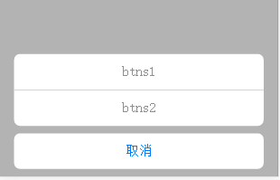

# actionSheet
## 效果图

## 使用方法
### 引用<script src="http://cdnjs.gtimg.com/cdnjs/libs/jquery/2.1.1-rc2/jquery.min.js"></script>
### 引用actionSheet.js
```javascript
  $.myActionSheet({
        //title:'测试',//可选
        //speed:'500',//动画时间，默认500，可配置
        //y:0,//内容与底部距离，默认0，可配置
        btns:[
            {
                name:'btns1',//自定义
                click:function(){
                  //业务代码
                    alert('btn1')
                }
            },
            {
                name:'btns2',//自定义
                click:function(){
                //业务代码
                    alert('btn2')
                }
            }
            ...
        ]
    });
```
